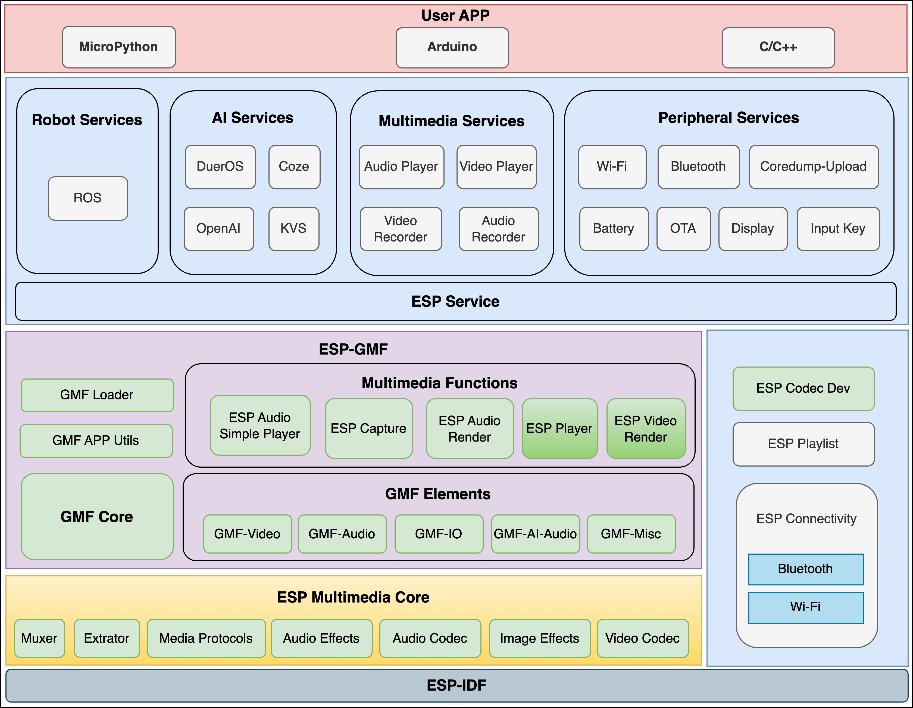

# Espressif Advanced Development Framework

[中文版](./README_CN.md)

## ⚠️ Important

The `master` branch contains the new features for **ADF v3.0**, which are actively developed and **incompatible** with previous versions. For the stable ADF v2.x version, please switch to the [`release/v2.x`](https://github.com/espressif/esp-adf/tree/release/v2.x) branch.

## Overview

**ESP-ADF** (Espressif Advanced Development Framework) is Espressif’s official **advanced application-layer development framework**, designed to simplify the development of audio, video, and IoT products.

**ADF v3.0** represents a **major architectural upgrade**, completely redesigned and **incompatible** with ADF v2.x. It focuses on product-oriented functionality, modular services, and low resource consumption.

### ESP-ADF vs ESP-IDF

- **ESP-IDF** is the base SDK for Espressif chips, offering low-level components such as OS, drivers, network stack, Bluetooth, etc.
- **ESP-ADF** is built on top of ESP-IDF, providing high-level product-oriented services, such as audio/video playback, battery service, OTA, and more.

## ✅ ADF v3.0 Features

**ADF v3.0** is a **product-oriented development framework** with **significant architectural changes** that are **completely incompatible** with previous ADF versions. Key features include:

- **ESP-GMF Integration**: Core media pipeline restructured using [**ESP-GMF**](https://github.com/espressif/esp-gmf) (General Multimedia Framework)
- **Standalone Components**: Functional components such as `playlist` can run independently
- **Product Services**: Modular services for **audio playback**, **video playback**, **battery monitoring**, and more
- **MCP Support**: Product services are callable via **Model Context Protocol (MCP)**
- **Multi-Product Support**: Designed for **audio**, **video**, and **IoT** products
- **Resource Efficient**: Optimized for **low memory and CPU usage**
- **Multi-Language App Support**: Supports development in **MicroPython**, **Arduino**, and **C/C++**

## ADF v3.0 Block Diagram

  

## Platform Requirements

- **ESP-IDF Version**: v5.5.2 or later

## Branch Strategy

- [`release/v2.x`](https://github.com/espressif/esp-adf/tree/release/v2.x): Legacy ADF implementation (v2). Receives only bug fixes and minor enhancements.
  See [ADF v2.x Documentation](https://docs.espressif.com/projects/esp-adf/en/latest/index.html) for reference.

- `master`: Development branch for **ADF v3.0**. Not compatible with v2.x APIs or behavior.

## Documentation

- ADF v3.0 documentation: Coming soon.
- ADF v2.x documentation: Available at [docs.espressif.com](https://docs.espressif.com/projects/esp-adf/en/latest/)

## Roadmap

- [ ] Functional Modules: e.g., **Playlist**, **Board Manager**
- [ ] Service Layer: e.g., **Wi-Fi Service** with **MCP (Model Context Protocol)** support
- [ ] AI Service Integration: e.g., **OpenAI**, **Coze**, etc.
- [ ] Expanded set of reusable product service plugins
